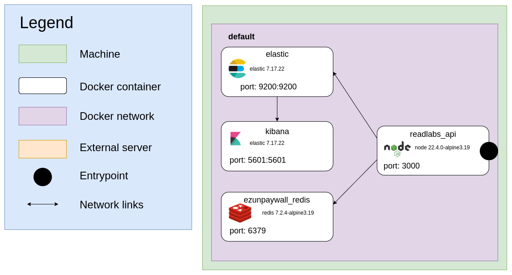

# ReadLabs

Readlabs is a service that centralizes and makes available metadata from CNRS laboratories. It offers a RESTful API accessible via an API key, enabling users to search for and obtain detailed information on laboratories. Data extracted from CNRS Reseda structure database.

**Table of content**
- [Description](#Description)
- [Network-flow](#Network-flow)
- [Installation](#Installation)
    - [Development](#Development)
        - [Prerequisites](#Prerequisites)
        - [Start](#Start)
        - [Tests](#Tests)
    - [Deployment](#Deployment)
      - [Prerequisites](#Prerequisites)
- [Data update](#Data-update)

## Description

Data updates are performed manually via Inist-CNRS internal scripts. Data is stored in an elastic index. To access this data, readlabs offers a RESTful API accessible via an API key.

For application administrators, it's possible to manage these keys via the API and a web interface (coming soon).

On the front, a nginx acts as a reverse proxy, redirecting all these services to a single entry point (coming soon).

Each service : 
* [api](./services/api#readlabs-api)
* [frontend](./services/frontend#readlabs-frontend)
* [update](./services/update#readlabs-update)

## Network-flow

readlabs is made up of several services which are distributed in several docker containers.


## Installation

```bash
git clone https://github.com/ezpaarse-project/readlabs 
```
### Development

#### Prerequisites

The tools you need to let readlabs run are :
* docker
* npm

Command : 

```bash
# install dependencies
npm i

# create volume for elastic
docker-compose -f docker-compose.debug.yml run --rm elastic chown -R elasticsearch /usr/share/elasticsearch/ 
```
#### Start

```bash
# Start readlabs as daemon
docker-compose -f docker-compose.debug.yml up -d

# Stop readlabs
docker-compose -f docker-compose.debug.yml stop

# Get the status of readlabs services
docker-compose -f docker-compose.debug.yml ps
```
#### Tests

No test are available (coming soon).

### Deployment

#### Prerequisites

* docker
* docker compose
* Total extracted data does not exceed 2000 rows

#### Environment variables

Create an environment file named `readlabs.local.env.sh` and export the following environment variables. You can then source `readlabs.env.sh`, which contains a set of predefined variables and is overridden by `readlabs.local.env.sh`.


### Adjust system configuration for Elasticsearch

Elasticsearch has some [system requirements](https://www.elastic.co/guide/en/elasticsearch/reference/current/system-config.html) that you should check.

To avoid memory exceptions, you may have to increase mmaps count. Edit `/etc/sysctl.conf` and add the following line :

```ini
# configuration needed for elastic search
vm.max_map_count=262144
```
Then apply the changes : 
```bash
sysctl -p
```
### Start/Stop/Status

Before you start readlabs, make sure all necessary environment variables are set.

```bash
# Start readlabs as daemon
docker-compose up -d

# Stop readlabs
docker-compose stop

# Get the status of readlabs services
docker-compose ps

